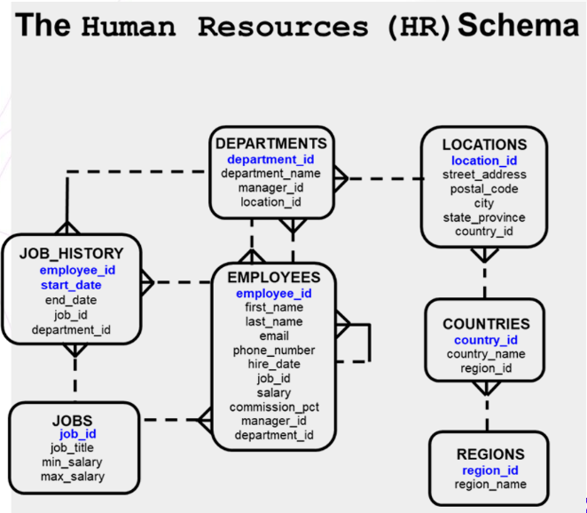

# Ejercicios Bases de Datos Relacionales
Usando la base de datos HR, realizar los siguientes ejercicios:

## Ejercicios básicos
### Ejercicio 1
El departamento de recursos humanos necesita un informe para mostrar el número de empleado, apellido, salario y el salario aumentado en un 15.5% (expresado como un número entero) para cada empleado. Etiquete la columna `New Salary`.

### Ejercicio 2
Modifique la consulta anterior para agregar una columna que reste el salario anterior del nuevo salario. Nombre la columna `Increase`.

### Ejercicio 3
Escriba una consulta que muestre el apellido (con la primera letra en mayúscula y todas las demás letras en minúscula) y la longitud del apellido para todos los empleados cuyo nombre comienza con las letras "J", "A" o "M". Dé a cada columna un nombre apropiado. Ordene los resultados por los apellidos de los empleados.

### Ejercicio 4
El departamento de recursos humanos quiere encontrar la duración del empleo para cada empleado. Para cada empleado, muestre el apellido y calcule la cantidad de meses entre hoy y la fecha en que se contrató al empleado. Etiquete la columna como `MONTHS_WORKED`. Ordene sus resultados por la cantidad de meses empleados. Redondea el número de meses hasta el número entero más cercano.

### Ejercicio 5
Cree una consulta que produzca lo siguiente para cada empleado: `<apellido del empleado> gana <salario> mensualmente, pero quiere <3 veces el salario.>`.  
Etiquete la columna `Dream Salaries`.

### Ejercicio 6
Muestre el apellido, la fecha de contratación y la fecha de revisión salarial de cada empleado, que es el primer lunes después de seis meses de servicio. Rotula la columna `REVIEW`. Formatee las fechas para que aparezcan en el formato similar a `Lunes, 31 de julio de 2000`.

### Ejercicio 7
Muestre el apellido, la fecha de contratación y el día de la semana en que comenzó el empleado. Etiquete la columna `DAY`. Ordene los resultados por día de la semana, comenzando con el lunes.

### Ejercicio 8
Cree una consulta que muestre los apellidos y los montos de las comisiones de los empleados. Si un empleado no gana comisión, muestre `Sin comisión`. Etiquete la columna `COMM`.

## Ejercicios avanzados
### Ejercicio 9
Cree una consulta para mostrar el apellido y el salario de todos los empleados. Formatee el salario para que tenga 15 caracteres de largo, con el símbolo de $ a la izquierda. Etiquete la columna `SALARY`.

### Ejercicio 10
Cree una consulta que muestre los primeros ocho caracteres de los apellidos de los empleados e indique los montos de sus salarios con asteriscos. Cada asterisco significa mil dólares. Ordene los datos en orden descendente de salario. Etiquete la columna `EMPLOYEES_AND_THEIR_SALARIES`.

### Ejercicio 11
Cree una consulta para mostrar el apellido y el número de semanas contratados para todos los empleados en el departamento 90. Etiquete el número de semanas en la columna `TENURE`. Trunca el valor de la cantidad de semanas a 0 decimales. Mostrar los registros en orden descendente de la tenencia del empleado.

### Ejercicio 9
Escriba una consulta que muestre la calificación de todos los empleados en función del valor de la columna `JOB_ID`, utilizando los siguientes datos:
| Job | Grade |
|-----|:-----:|
| Administration Vice President | A |
| Sales Manager | B |
| Programmer | C |
| Sales Representative | D |
| Stock Clerk | E |
| None of the above | 0 |
