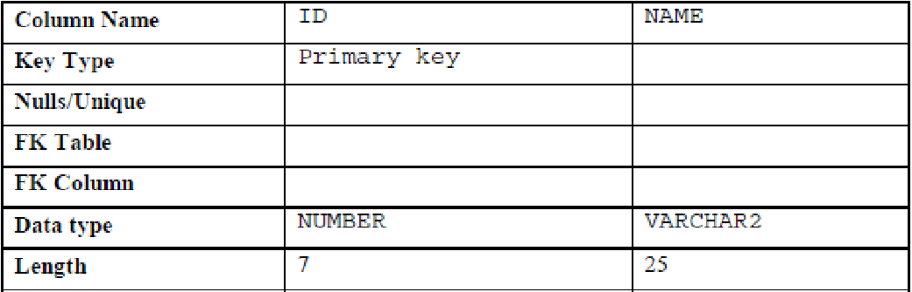
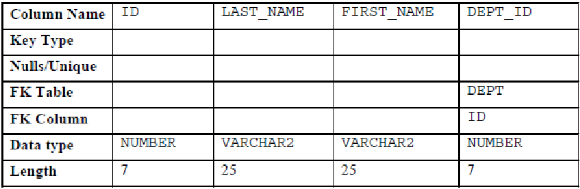

# Ejercicios Bases de Datos Relacionales

## Ejercicios DDL
- Crear una nueva base de datos SQLite3: `PracticaDDL.db`
- Abrir la base de datos usando DBeaver CE
### Ejercicio 1

1. Crear la tabla `DEPT` con los campos descritos en la tabla anterior.
2. Aplique las restricciones `NOT NULL` y `PRIMARY KEY` a la tabla

### Ejercicio 2

Ejercicio 2
1. Crear la tabla `EMP` con los campos descritos en la tabla anterior.
2. Agregar la restricción de llave primaria a la tabla `EMP` en el campo `ID`
3. Agregar la restricción de llave foránea a la columna `DEPT_ID` al `ID` de la tabla `DEPT`.

### Ejercicio 3
1. Intenta eliminar la tabla DEPT.
  - ¿Pudo realizarse el borrado?
  - ¿Cuál fue la razón de este comportamiento?
2. Elimina la tabla EMP.
  - ¿Pudo realizarse el borrado?
  - ¿Por qué ahora se logró borrar?
3. Elimina la tabla DEPT.

## Ejercicios SELECT (Proyección)
Usando la base de datos HR, realizar los siguientes ejercicios:

### Ejercicios básicos
#### Ejercicio 4
El departamento de recursos humanos desea que una consulta muestre el apellido, la identificación del trabajo, la fecha de contratación y la identificación del empleado para cada empleado, apareciendo primero la identificación del empleado. Proporcione un alias `STARTDATE` para la columna `HIRE_DATE`.

#### Ejercicio 5
El departamento de recursos humanos desea que una consulta muestre todos los ID de trabajo únicos de la tabla `EMPLOYEES`.

### Ejercicios avanzados
#### Ejercicio 6
El departamento de recursos humanos quiere encabezados de columna más descriptivos para su informe sobre los empleados (ejercicio 4). Nombre los encabezados de columna `Emp #`, `Employee`, `Job` y `Hire Date`.

#### Ejercicio 7
El departamento de recursos humanos ha solicitado un informe de todos los empleados y sus ID de trabajo. Muestre el apellido concatenado con la `ID` del trabajo (separados por una coma y un espacio) y nombre la columna `Employee and Title`.

#### Ejercicio 8
Para familiarizarse con los datos en la tabla `EMPLOYEES`, cree una consulta para mostrar todos los datos de esa tabla. Separe cada columna de salida por una coma. Nombre el título de la columna `THE_OUTPUT`.

## Ejercicios SELECT (Selección)
Usando la base de datos HR, realizar los siguientes ejercicios:
### Ejercicios básicos
#### Ejercicio 9
Debido a problemas de presupuesto, el departamento de recursos humanos necesita un informe que muestre el apellido y el salario de los empleados que ganan más de $ 12.000.

#### Ejercicio 10
Cree un informe que muestre el apellido y el número de departamento para el número de empleado 176.

#### Ejercicio 11
El departamento de recursos humanos necesita encontrar empleados con sueldos altos y bajos. Crea un informe para mostrar el apellido y el salario de cualquier empleado cuyo salario no esté en el rango de $ 5.000 a $ 12.000.

#### Ejercicio 12
Cree un informe para mostrar el apellido, la identificación del trabajo y la fecha de contratación para los empleados con los apellidos de **Matos** y **Taylor**. Ordene la consulta en orden ascendente por la fecha de contratación.

#### Ejercicio 13
Muestra el apellido y la identificación del departamento de todos los empleados en los departamentos 20 o 50 en orden alfabético ascendente por nombre.

#### Ejercicio 14
Crea un informe para mostrar el apellido y el salario de los empleados que ganan entre $ 5.000 y $ 12.000, y están en el departamento 20 o 50. Etiquete las columnas `Employee` y `Monthly Salary`, respectivamente.

#### Ejercicio 15
El departamento de recursos humanos necesita un informe que muestre el apellido y la fecha de contratación de todos los empleados que fueron contratados en 1994.

#### Ejercicio 16
Cree un informe para mostrar el apellido y el cargo de todos los empleados que no tienen un gerente.

#### Ejercicio 17
Cree un informe para mostrar el apellido, el salario y la comisión de todos los empleados que ganan comisiones. Ordenar datos en orden descendente de salario y comisiones. Use la posición numérica de la columna en la cláusula `ORDER BY`.

### Ejercicios Avanzados
#### Ejercicio 18
Muestra todos los apellidos de los empleados en los que la tercera letra del nombre es "a".

#### Ejercicio 19
Muestre los apellidos de todos los empleados que tienen tanto una "a" como una "e" en su apellido.

#### Ejercicio 20
Muestre el apellido, el trabajo y el salario de todos los empleados cuyos trabajos sean los de un representante de ventas o de un empleado de bolsa, y cuyos salarios no sean iguales a $ 2.500, $ 3.500 o $ 7.000.

#### Ejercicio 21
Cree un informe para mostrar el apellido, el salario y la comisión de todos los empleados cuya comisión es del 20%.

# Ejercicios Adicionales
Usando la base de datos HR, realizar los siguientes ejercicios:

## Ejercicios básicos
### Ejercicio 1
El departamento de recursos humanos necesita un informe para mostrar el número de empleado, apellido, salario y el salario aumentado en un 15.5% (expresado como un número entero) para cada empleado. Etiquete la columna `New Salary`.

### Ejercicio 2
Modifique la consulta anterior para agregar una columna que reste el salario anterior del nuevo salario. Nombre la columna `Increase`.

### Ejercicio 3
Escriba una consulta que muestre el apellido (con la primera letra en mayúscula y todas las demás letras en minúscula) y la longitud del apellido para todos los empleados cuyo nombre comienza con las letras "J", "A" o "M". Dé a cada columna un nombre apropiado. Ordene los resultados por los apellidos de los empleados.

### Ejercicio 4
El departamento de recursos humanos quiere encontrar la duración del empleo para cada empleado. Para cada empleado, muestre el apellido y calcule la cantidad de meses entre hoy y la fecha en que se contrató al empleado. Etiquete la columna como `MONTHS_WORKED`. Ordene sus resultados por la cantidad de meses empleados. Redondea el número de meses hasta el número entero más cercano.

### Ejercicio 5
Cree una consulta que produzca lo siguiente para cada empleado: `<apellido del empleado> gana <salario> mensualmente, pero quiere <3 veces el salario.>`.  
Etiquete la columna `Dream Salaries`.

### Ejercicio 6
Muestre el apellido, la fecha de contratación y la fecha de revisión salarial de cada empleado, que es el primer lunes después de seis meses de servicio. Rotula la columna `REVIEW`. Formatee las fechas para que aparezcan en el formato similar a `Lunes, 31 de julio de 2000`.

### Ejercicio 7
Muestre el apellido, la fecha de contratación y el día de la semana en que comenzó el empleado. Etiquete la columna `DAY`. Ordene los resultados por día de la semana, comenzando con el lunes.

### Ejercicio 8
Cree una consulta que muestre los apellidos y los montos de las comisiones de los empleados. Si un empleado no gana comisión, muestre `Sin comisión`. Etiquete la columna `COMM`.

## Ejercicios avanzados
### Ejercicio 9
Cree una consulta para mostrar el apellido y el salario de todos los empleados. Formatee el salario para que tenga 15 caracteres de largo, con el símbolo de $ a la izquierda. Etiquete la columna `SALARY`.

### Ejercicio 10
Cree una consulta que muestre los primeros ocho caracteres de los apellidos de los empleados e indique los montos de sus salarios con asteriscos. Cada asterisco significa mil dólares. Ordene los datos en orden descendente de salario. Etiquete la columna `EMPLOYEES_AND_THEIR_SALARIES`.

### Ejercicio 11
Cree una consulta para mostrar el apellido y el número de semanas contratados para todos los empleados en el departamento 90. Etiquete el número de semanas en la columna `TENURE`. Trunca el valor de la cantidad de semanas a 0 decimales. Mostrar los registros en orden descendente de la tenencia del empleado.

### Ejercicio 9
Escriba una consulta que muestre la calificación de todos los empleados en función del valor de la columna `JOB_ID`, utilizando los siguientes datos:
| Job | Grade |
|-----|:-----:|
| Administration Vice President | A |
| Sales Manager | B |
| Programmer | C |
| Sales Representative | D |
| Stock Clerk | E |
| None of the above | 0 |
