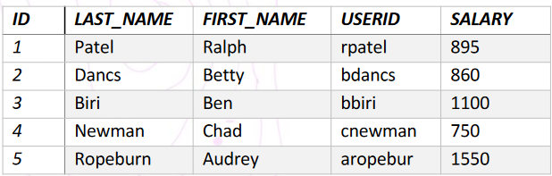

# Ejercicios Bases de Datos Relacionales
Usando la base de datos HR, realizar los siguientes ejercicios:


## Funciones Multi-fila (GROUP BY)
### Ejercicios básicos
#### Ejercicio 1
Encuentre el salario más alto, más bajo, suma y promedio de todos los empleados. Etiquete las columnas `Maximum`, `Minimum`, `Sum` y `Average`, respectivamente. Redondea tus resultados al número entero más cercano.

#### Ejercicio 2
Modifique la consulta anterior para mostrar el salario mínimo, máximo, suma y promedio para cada tipo de trabajo.

#### Ejercicio 3
Escriba una consulta para mostrar el número de personas con el mismo trabajo.

#### Ejercicio 4
Determine la cantidad de gerentes sin nombrarlos. Etiquete la columna `Number of Managers`. **Sugerencia**: use la columna `MANAGER_ID` para determinar el número de administradores.

#### Ejercicio 5
Encuentra la diferencia entre el salario más alto y el más bajo. Etiquete la columna `DIFFERENCE`.

### Ejercicios avanzados
#### Ejercicio 6
Cree un informe para mostrar el número de gerente y el salario del empleado con el salario más bajo para ese gerente. Excluir a cualquiera cuyo gerente no sea conocido. Excluya cualquier grupo donde el salario mínimo sea de $ 6,000 o menos. Ordene la salida en orden descendente de salario.

#### Ejercicio 7
Cree una consulta para mostrar el número total de empleados y, de ese total, el número de empleados contratados en 2005, 2006, 2007 y 2008. Cree encabezados de columna apropiados.

#### Ejercicio 8
Cree una consulta matricial para mostrar el trabajo, el salario de ese trabajo según el número de departamento y el salario total de ese trabajo, para los departamentos 20, 50, 80 y 90, dando a cada columna un encabezado apropiado.

## Datos de multiples tablas (JOIN)
### Ejercicios básicos
#### Ejercicio 9
Escriba una consulta para el departamento de recursos humanos para producir las direcciones de todos los departamentos. Utilice las tablas de `LOCATIONS` y `COUNTRIES`. Muestre la identificación de ubicación, la dirección, la ciudad, el estado o la provincia y el país en la salida. Use una `NATURAL JOIN` para producir los resultados.

#### Ejercicio 10
El departamento de recursos humanos necesita un informe de sólo aquellos empleados con los departamentos correspondientes. Escriba una consulta para mostrar el apellido, el número de departamento y el nombre de departamento para estos empleados.

#### Ejercicio 11
El departamento de recursos humanos necesita un informe de los empleados en Toronto. Muestre el apellido, el trabajo, el número de departamento y el nombre del departamento para todos los empleados que trabajan en Toronto.

#### Ejercicio 12
Cree un informe para mostrar el apellido y el número del empleado junto con el apellido y el número del gerente. Etiquete las `Employee`, `Emp#`, `Manager` y `Mgr#`, respectivamente.

#### Ejercicio 13
Modifique el informe anterior para mostrar a todos los empleados, incluido **King**, que no tiene gerente. Ordene los resultados por el número de empleado.

#### Ejercicio 14
Cree un informe para el departamento de recursos humanos que muestre los apellidos de los empleados, los números de departamento y todos los empleados que trabajan en el mismo departamento que un empleado determinado. Dé a cada columna una etiqueta apropiada.

#### Ejercicio 15
El departamento de recursos humanos necesita un informe sobre las calificaciones laborales (tabla JOB_GRADES) y los salarios. Cree una consulta que muestre el nombre, el trabajo, el nombre del departamento, el salario y la calificación de todos los empleados.

### Ejercicios avanzados
#### Ejercicio 16
El departamento de recursos humanos quiere determinar los nombres de todos los empleados que fueron contratados después de **Davies**. Cree una consulta para mostrar el nombre y la fecha de contratación de cualquier empleado contratado después del empleado **Davies**.

#### Ejercicio 17
El departamento de recursos humanos necesita encontrar los nombres y las fechas de contratación de todos los empleados que fueron contratados antes que sus gerentes, junto con los nombres y fechas de contratación de sus gerentes.

## Subconsultas
### Ejercicios básicos
#### Ejercicio 18
El departamento de recursos humanos necesita una consulta que solicite al usuario el apellido de un empleado. La consulta luego muestra el apellido y la fecha de contratación de cualquier empleado en el mismo departamento que el empleado cuyo nombre proporcionan (excluyendo a ese empleado). Por ejemplo, si el usuario ingresa a **Zlotkey**, busque todos los empleados que trabajan con Zlotkey (excluyendo Zlotkey).

#### Ejercicio 19
Cree un informe que muestre el número de empleado, el apellido y el salario de todos los empleados que ganan más que el salario promedio. Ordene los resultados en orden de salario ascendente.

#### Ejercicio 20
Escriba una consulta que muestre el número de empleado y el apellido de todos los empleados que trabajan en un departamento con cualquier empleado cuyo apellido contenga la letra "u".

#### Ejercicio 21
El departamento de recursos humanos necesita un informe que muestre el apellido, el número de departamento y la identificación de trabajo de todos los empleados cuya identificación de ubicación de departamento es 1700.

#### Ejercicio 22
Cree un informe para Recursos Humanos que muestre el apellido y el salario de cada empleado que se reporta a King.

#### Ejercicio 23
Cree un informe para RRHH Que muestre el número de departamento, el apellido y la identificación del trabajo para cada empleado del departamento Ejecutivo.

#### Ejercicio 24
Cree un informe que muestre una lista de todos los empleados cuyo salario es mayor que el de cualquier empleado del departamento 60.

## Operaciones de conjunto
### Ejercicios básicos
#### Ejercicio 25
El departamento de recursos humanos necesita una lista de ID de departamento para los departamentos que no contienen la ID de trabajo `Stock Clerk`.

#### Ejercicio 26
El departamento de recursos humanos necesita una lista de países que no tienen departamentos ubicados en ellos. Muestra la identificación del país y el nombre de los países.

#### Ejercicio 27
Produzca una lista de trabajos para los departamentos 10, 50 y 20, en ese orden. Mostrar la ID del trabajo y la ID del departamento.

#### Ejercicio 28
Cree un informe que enumere las identificaciones de los empleados y las identificaciones de los empleados que actualmente tienen un título de trabajo que es el mismo que el de su trabajo cuando fueron contratados inicialmente por la empresa (es decir, cambiaron de trabajo, pero ahora han vuelto a haciendo su trabajo original).

#### Ejercicio 29
El departamento de recursos humanos necesita un informe con las siguientes especificaciones:
1. Apellido e identificación del departamento de todos los empleados de la tabla `EMPLOYEES`, independientemente de si pertenecen o no a un departamento
2. ID de departamento y nombre de departamento de todos los departamentos de la tabla `DEPARTMENTS`, independientemente de si tienen empleados trabajando en ellos. 

Escriba una consulta compuesta para lograr esto.

## Manipulando datos
```sql
CREATE TABLE my_employee (
  id NUMBER(4) NOT NULL,
  last_name VARCHAR(25),
  first_name VARCHAR(25),
  userid VARCHAR(8),
  salary NUMBER(9,2)
);
```



### Ejercicios básicos
#### Ejercicio 30
1. Cree una instrucción INSERT para
agregar la primera fila de datos a la tabla
MY_EMPLOYEE a partir de los siguientes
datos de muestra. No nombre las
columnas en la cláusula INSERT. No
ingrese todas las filas todavía.
2. Rellene la tabla MY_EMPLOYEE con la
segunda fila de los datos de muestra de la
lista anterior. Esta vez, enumere las
columnas explícitamente en la cláusula
INSERT.
3. Verifique su inserción a la tabla.

#### Ejercicio 31
1. Rellene la tabla MY_EMPLOYEE con las
siguientes dos filas de los datos de
muestra de la lista anterior.
2. Verifique su inserción a la tabla.

#### Ejercicio 32
1. Cambie el apellido del empleado 3 a
`Drexler`.
2. Cambie el salario a $ 1.000 para todos los empleados que tengan un salario inferior a $ 900.
3. Verifique sus cambios en la tabla.

#### Ejercicio 33
1. Eliminar `Betty Dancs` de la tabla `MY_EMPLOYEE`.
2. Verifique sus cambios en la tabla.

#### Ejercicio 34
1. Rellene la tabla con la última fila de los datos de muestra.
2. Verifique su inserción a la tabla.

#### Ejercicio 35
1. Elimine todas las filas de la tabla `MY_EMPLOYEE`.
2. Verifique que la tabla está vacía.
