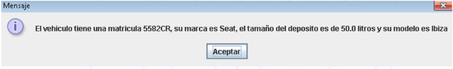

# Ejercicios Manejo de Archivos

## Ejercicio 1
Crea un fichero de texto con el nombre y contenido que tu quieras. Ahora crea una aplicación que lea este fichero de texto carácter a carácter y muestre su contenido por pantalla sin espacios. Por ejemplo, si un fichero tiene el siguiente texto `Esto es una prueba`, deberá mostrar `Estoesunaprueba`.  
Captura las excepciones que veas necesario.

## Ejercicio 2
Crea una aplicación donde pidamos la ruta de un fichero por teclado y un texto que queramos a escribir en el fichero. Deberás mostrar por pantalla el mismo texto pero variando entre mayúsculas y minúsculas, es decir, si escribo `Bienvenido` deberá devolver `bIENVENIDO`. Si se escribe cualquier otro carácter, se quedará tal y como se escribió.  
Deberás crear un método para escribir en el fichero el texto introducido y otro para mostrar el contenido en mayúsculas.

## Ejercicio 3
Crea una aplicación que almacene los datos básicos de un vehículo como la matricula(String), marca (String), tamaño de depósito (Double) y modelo (String) en ese orden y de uno en uno usando la clase DataInputStream.  
Los datos anteriores datos se pedirán por teclado y se irán añadiendo al fichero (no se sobrescriben los datos) cada vez que ejecutemos la aplicación.  
Muestra todos los datos de cada vehículo en un cuadro de diálogo (JOptionPane), es decir, si tenemos 3 vehículos mostrará 3 cuadros de diálogo con sus respectivos datos. Un ejemplo de salida de información puede ser este:  
